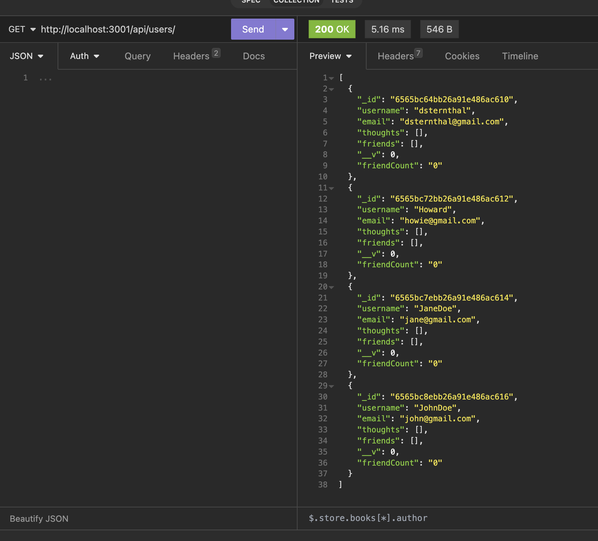
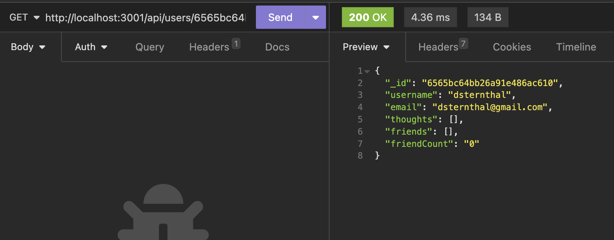
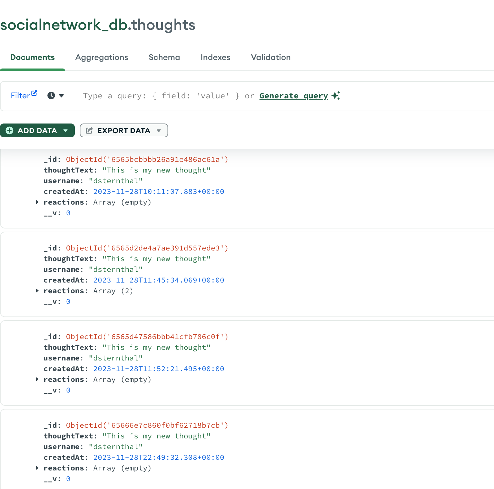

# challenge15-SocialNetwork

# Description

## Usage
Create Users, Thoughts, Friends, and Reaction
Remove Thoughts, Friends & Reactions 
Update THoughts & Users

## License

    
    THE SOFTWARE IS PROVIDED “AS IS”, WITHOUT WARRANTY OF ANY KIND, EXPRESS OR IMPLIED, INCLUDING BUT NOT LIMITED TO THE WARRANTIES OF MERCHANTABILITY, FITNESS FOR A PARTICULAR PURPOSE AND NONINFRINGEMENT. IN NO EVENT SHALL THE AUTHORS OR COPYRIGHT HOLDERS BE LIABLE FOR ANY CLAIM, DAMAGES OR OTHER LIABILITY, WHETHER IN AN ACTION OF CONTRACT, TORT OR OTHERWISE, ARISING FROM, OUT OF OR IN CONNECTION WITH THE SOFTWARE OR THE USE OR OTHER DEALINGS IN THE SOFTWARE.
  

## Contributions

Danielle Sternthal, Phil Loy, Daniel & Quentin (TAs in Class)
AskBCS

## Screenshots of Insomia 

Get All Users: 

Get a Single User by ID: 

MongoDB

## Video Demonstration of Insomia 
Video Demonstration 
https://drive.google.com/file/d/1eb9xtO9xuxF9CmfekFJVp10UiZGFePHb/view

## GitHub Repo
https://github.com/dsternthal/challenge15_SocialNetwork